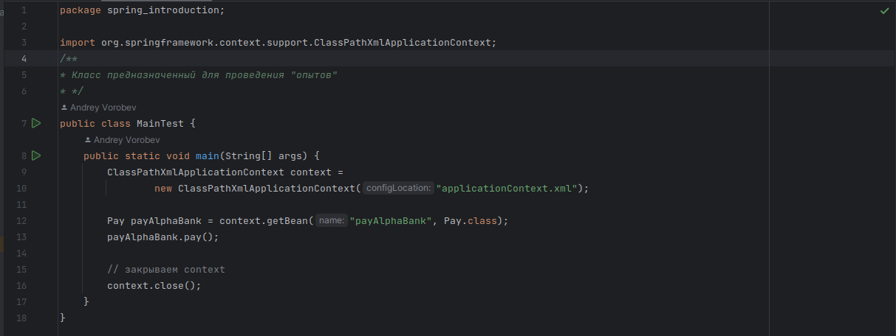

# Spring - основной фреймворк для Java # 

Spring предлагает *контейнер*, часто называемым **контекстом приложения
Spring**, который создаёт компоненты приложения и управляет ими. Эти компоненты, или *bean-компоненты*,
объединяются внутри контекста Spring.

Помимо основного контейнера, Spring и сопутствующие библиотеки предлагают веб-фреймворк, различные механизмы хранения данных, фреймворк безопасности, интеграцию с другими системами, мониторинг
времени выполнения, поддержку микросервисов, модель реактивного программирования и многое другое для разработки современных приложений.

Акт объединения *bean-компонентов* основан на шаблоне, известном как **внедрение зависимостей (Dependency Injection, DI)**.

В технологии внедрения зависимостей компоненты не создаются и не поддерживают жизненный цикл других компонентов, от которых
они зависят, а полагаются на отдельный объект (**контейнер**), который создаёт все нужные компоненты и внедряет их в другие компоненты.

### Основные функции Spring Container:
- IoC - инверсия управления. Создание и управление объектами. То есть передача программистом прав на создание и управление Spring-у;
- DI - внедрение зависимостей. 

## Способы конфигурации Spring Container:


### XML file
Spring container-у необходимо описать, в конфигурационном файле, сколько и каких объектов создать. Только после этого мы можем сказать, что жизненным циклом управляет Spring.
Этот конфигурационный файл будем создавать в папке "*resources*", по сложившейся традиции принято называть "**applicationContext.xml**"
Пример:
<details>
<summary>applicationContext.xml</summary>

```html
<?xml version="1.0" encoding="UTF-8"?>
<beans xmlns="http://www.springframework.org/schema/beans"
       xmlns:xsi="http://www.w3.org/2001/XMLSchema-instance"
       xmlns:context="http://www.springframework.org/schema/context"
       xsi:schemaLocation="http://www.springframework.org/schema/beans
       http://www.springframework.org/schema/beans/spring-beans.xsd
       http://www.springframework.org/schema/context
       http://www.springframework.org/schema/context/spring-context.xsd">
</beans>
```
</details>

Не будем подробно разбирать данный текст, тут всего лишь описывается, что мы можем использовать Spring Framework.
Введём определение: 

**bean** - это объект, который создается и управляется Spring Container.
Разберём на примере оплаты заказов различными способами. Создаём bean для класса AlphaBank, для этого в "*xml file*" прописываем следующие:
```html
    <bean id = "payAlphaBank"
          class="spring_introduction.AlphaBank">
    </bean>
```
- `id` - имя по которому мы будем обращаться к Spring-у для создания объекта;

- `class` - полное имя класса.

Теперь переходим в класс `MainTest` и указываем, что дальше мы хотим использовать applicationContext следующим способом:
```java
ClassPathXmlApplicationContext context =
        new ClassPathXmlApplicationContext("applicationContext.xml");
```
В качестве аргумента передаём название xml file, если вы выбрали другое название.

Остаётся создать bean `payAlphaBank`, вызвать наш метод `pay()` и закрыть `context`

```java
Pay payAlphaBank = context.getBean("payAlphaBank", Pay.class);
payAlphaBank.pay();

// закрываем context
context.close();
```


После этого, _добавим зависимость_ например человека "Person". Который в свою очередь будет зависеть от "Pay", и метод
оплаты "yourPay()"

_Способы внедрения зависимостей с помощью_:
- Конструктора;
- Сеттеров;
- Autowiring.

```java
public class Person {
    private Pay pay;

    public Person(Pay pay) {
        this.pay = pay;
    }

    public void yourPay(){
        System.out.println("Способ оплаты:");
        pay.pay();
    }
}
```

Создадим новый класс для иллюстрации `MainTestAddDI`, теперь получим bean класса `AplhaBank` и передадим его в качестве 
параметра, конструктору. 

```java
public class MainTestAddDI {
    public static void main(String[] args) {
        ClassPathXmlApplicationContext context =
                new ClassPathXmlApplicationContext("applicationContext.xml");
        // получаем bean
        Pay pay = context.getBean("payAlphaBank", Pay.class);

        Person person = new Person(pay); //передаём в качестве параметра
        // проверим, что всё работает
        person.yourPay();

        context.close();
    }
}
```
Уже лучше, но неидеально. Мы по прежнему создаём экземпляр класса через `new`, а наша задача, передать 
управление зависимостями _Spring_-y.

Для этого, нашему `applicationContext.xml` необходимо указать для bean класса `Person` ссылку на `id` параметра,
в нашем случае это `payAlphaBank`


- `<constructor-arg ref="id_bean_зависимого_объекта"/>`

Теперь нам не нужно, явно создавать объект `AlphaBank`, достаточно получить bean через `getBean()` и совершить 
необходимые действия.
```java
public class MainTestAddDIConstructorArg {
    public static void main(String[] args) {
        ClassPathXmlApplicationContext context =
                new ClassPathXmlApplicationContext("applicationContext.xml");

        Person person = context.getBean("person", Person.class);
        person.yourPay();

        context.close();
    }
}
```
Вывод от проделанных действий не меняется


Рассмотрим способ внедрения зависимостей с помощью сеттеров. Создадим несколько полей для нашего `Person`: `name` типа _String_ и `age` типа _byte_. Плюс геттеры и сеттеры.

В XML file записываем новый тег `<property ... />`

```xhtml
    <bean id = "person"
          class="spring_introduction.Person">
        <!--Зависимости через конструктор-->
        <constructor-arg ref="payAlphaBank"/>

        <!--Зависимости через сеттеры-->
        <property name="name" value="Andrey"/>
        <property name="age" value="21"/>
    </bean>
```

- Атрибут `name` - это имя сеттера, с маленькой буквы без приставки `set`: `setName` -> `name`; `setAge` -> `age` и т.д.
- Атрибут `value` - значение которое мы хотим установить полю.

Давайте теперь отобразим в консоли значения полей через геттеры. В имеющемся классе `MainTestAddDIConstructorArg` добавим вывод

```java
System.out.println("Name - "+person.getName());
System.out.println("Age - "+person.getAge());
```


Вот такой не замысловатый способ, но Вам скорее всего покажется, что мы в разы усложнили процесс создания объекта.
Но это на первый взгляд, на самом деле при увеличении количества объектов и зависимостей между ними, Spring позволит нам 
избавиться от рутинной работы.

### Annotation and XML file
### Java code